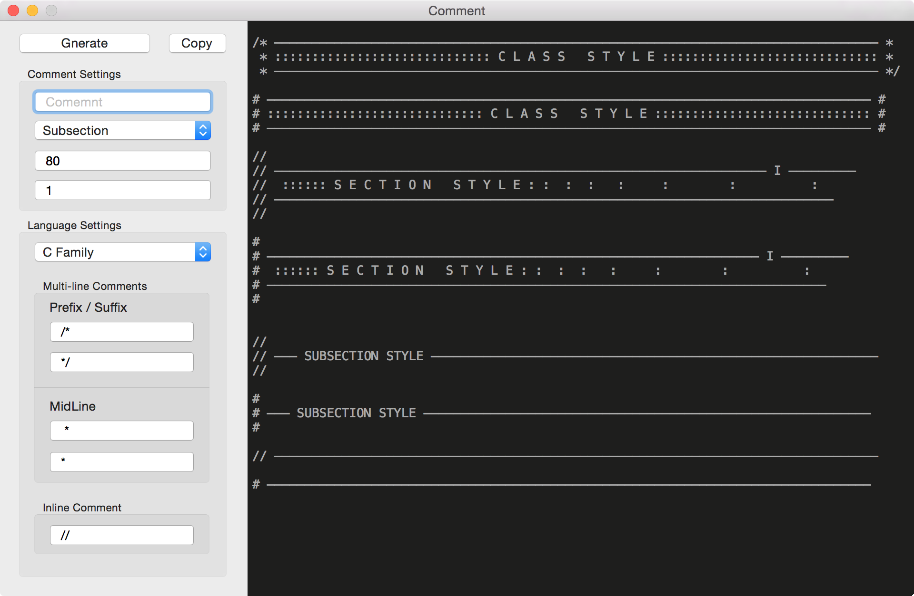

<br />

# Comment

What can I say? I love my style of code commenting. (Checkout [this](https://github.com/pmkary/Comment/blob/master/Comment/MainWindowController.swift) as an example). My style is so much clear, well sectioned and beautiful. However in a code of my style something like 68% of the LoC is `comment` + `whitespace`. You'll need a good comment generator. So... Here is the one! It supports all the possible KaryStyle comments and settings for all languages.

<br />

## License

```
Comment - The most professional comment generator of all time!
Copyright (c) 2015 Pouya Kary <k@arendelle.org>


This program is free software: you can redistribute it and/or modify
it under the terms of the GNU General Public License as published by
the Free Software Foundation, either version 3 of the License, or
(at your option) any later version.

This program is distributed in the hope that it will be useful,
but WITHOUT ANY WARRANTY; without even the implied warranty of
MERCHANTABILITY or FITNESS FOR A PARTICULAR PURPOSE.  See the
GNU General Public License for more details.

You should have received a copy of the GNU General Public License
along with this program.  If not, see <http://www.gnu.org/licenses/>.
``` 